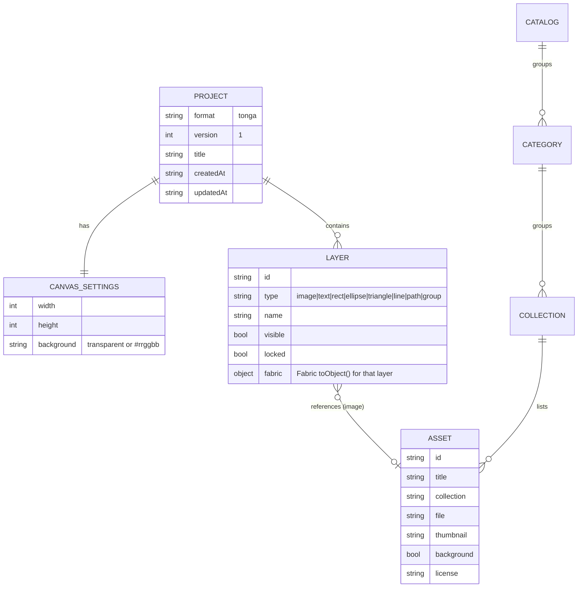

# AI-native spec — Tonga

Fuentes: `BUSINESS_RULES.md` (127 reglas), `DATA_OBJECTS.md`, `topology.json`, `ASSESSMENT.md`, `MODERNIZATION_BRIEF.md` §5 y `1er-prompt.md`.
Interfaces: las cataloga el mapa (`data-lineage.mmd`). Es una app estática sin red de salida, por lo que no se ha lanzado un agente aparte para catalogarlas.

## Capabilities

| # | Capacidad | Origen | Prioridad en el destino |
|---|---|---|---|
| C1 | Crear un lienzo (presets: A4 vertical/horizontal, 16:9, cuadrado, personalizado) con fondo transparente o de color | RULE-068, prompt §29-30 | P0 |
| C2 | Insertar desde la biblioteca, como objeto o como fondo, con búsqueda, categorías y lazy loading | RULE-105/044/112/083/084, prompt §13-14 | P0 |
| C3 | Importar PNG, JPEG, WebP, SVG saneado y `.tonga`; SVG legacy con `data-background` | RULE-113/046/047, prompt §20 | P0 |
| C4 | Texto, formas (rectángulo, elipse, triángulo, línea), dibujo libre | RULE-057/080/116 | P0 |
| C5 | Seleccionar, mover, redimensionar, rotar, voltear, duplicar, copiar y pegar, borrar, agrupar y desagrupar, alinear, ordenar capas | RULE-006/007/032/065/090/100/119 | P0 |
| C6 | Inspector: posición, tamaño, rotación, opacidad, relleno, trazo, grosor, tipografía, filtros básicos de imagen | RULE-001/043/106 | P1 |
| C7 | Undo/redo fiable con coalescencia y límite | RULE-070/071/072/060 | P0 |
| C8 | Zoom (+/−, ajustar, 100 %), pan y rejilla opcional | RULE-003/004/005 | P1 |
| C9 | Exportar PNG/JPEG (escala, calidad, transparencia) y SVG vectorial escapado; PDF A4 | RULE-022/086/101/102/103/108/114 | P0 |
| C10 | Proyecto `.tonga` (JSON, `format`+`version`, migraciones); abrir y descargar | prompt §16 | P0 |
| C11 | Autosave en IndexedDB, recuperación, aviso de cambios sin guardar | prompt §17 | P1 |
| C12 | Panel de capas accesible: nombre, tipo, visible, bloqueado, orden | prompt §12, §25, §31 | P0 |
| C13 | Teclado completo, sin capturar en campos de texto; ayuda con atajos | RULE-100, prompt §19 | P0 |
| C14 | Temas claro/oscuro/sistema, responsive, sin dependencias externas en runtime | RULE-109, prompt §24, §26, §33 | P1 |
| C15 | Acerca de / Créditos / Licencias generados desde datos; aviso legal y privacidad | RULE-099/111, prompt §39 | P1 |
| C16 | PWA instalable con shell offline | prompt §32 | P2 |

**Se dejan fuera a propósito** (valores por defecto del brief §7): máscaras, vectorización de iconos con ImageTracer, modos de fusión con nombres en español, el sonido al insertar y el recorte destructivo de la imagen base. El recorte se sustituye por recortar el lienzo al contenido o a la selección. Si una docente lo pide, se puede retomar más adelante.

## Domain Model



`Project.layers[i].fabric` contiene el `toObject()` de Fabric de esa capa. **Nunca se guarda el canvas entero de Fabric**: el orden, la visibilidad, el bloqueo y el nombre son de Tonga, y las migraciones operan sobre el documento de Tonga.

## Interface Contracts

No hay HTTP propio. Las interfaces son ficheros:

```yaml
# Inbound
catalog.json:           # GET ./catalog.json (generado en build desde repositorios/**/lista.txt)
  type: object
  required: [version, categories, collections, assets]
user-file:              # <input type=file> / drag & drop
  accept: [image/png, image/jpeg, image/webp, image/svg+xml, .tonga]
  maxBytes: 20MB
  maxPixels: 8192 x 8192
project.tonga:          # application/json
  required: [format: "tonga", version: 1, canvas, layers]
# Outbound (descargas locales; nada sale del navegador)
export: [image/png, image/jpeg, image/svg+xml, application/pdf, application/json(.tonga)]
storage: IndexedDB "tonga" / store "autosave" (1 registro); localStorage "tonga:prefs"
```

## Non-functional requirements

- Estático: `npm ci && npm run build` → `dist/` relativo (raíz, subdirectorio, Pages).
- Sin peticiones de red a terceros; CSP estricta posible (sin `eval`, sin scripts ni handlers en línea).
- JS inicial < 250 KB gzip (Fabric pesa ~90 KB gzip); 0 miniaturas en la carga inicial.
- Chromium, Firefox y WebKit actuales; WCAG 2.2 AA como referencia.

## Behavior Contract

Es el del brief §5 (RULE-113/046, 086/102/103, 108/101, 114, 022, 068, 070/071/072, 100, 105/044/112, 083/084, 109, 099/111). Cada regla tendrá un test Vitest o Playwright que cite su ID.
