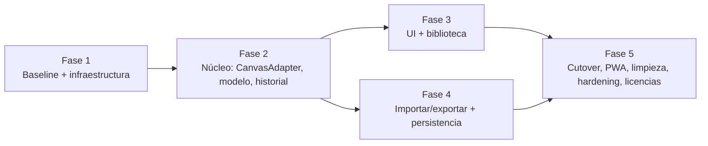

# Modernization Brief: Tonga

Fecha: 2026-10-02 · Stack objetivo: **Vite + TypeScript + Fabric.js 7.4 (estático, GitHub Pages)**
Entradas: `INTENT.md` (17:04), `PREFLIGHT.md` (17:13), `ASSESSMENT.md` (17:15), `topology.json` (17:20), `BUSINESS_RULES.md` (17:33), además de los requisitos de `1er-prompt.md`. No hay `RULE_REVIEWS.json`.

> El aprobador dirige la ejecución **editando este fichero**. Los criterios que se editen aquí se respetan; los mensajes de chat, no.

## 1. Objective

Tonga es hoy un fork sin código fuente de TOAST UI Image Editor 3.6.0, que está archivado. Ese fork lleva dentro un Fabric 2.7 parcheado y funciona junto a jQuery 1.7.2, jQuery UI 1.8 y jsPDF 2.1, todos con CVEs conocidas. No tiene tests, ni build, y el CI publica el repositorio entero. El plan es **reconstruir Tonga como una aplicación estática pequeña y mantenible**: Vite + TypeScript + Fabric ≥ 7.4.0 (la primera versión sin las XSS de exportación SVG GHSA-hfvx-25r5-qc3w y GHSA-w22m-hvvm-xmwx), sin framework SPA, con UI nueva accesible y responsive, biblioteca con búsqueda, formato de proyecto `.tonga`, autoguardado y PWA. Se publicará en `https://ateeducacion.github.io/tonga/` desde `main` mediante CI. **Por qué ahora:** cada mes que pasa aumenta el coste. Las dependencias no se pueden actualizar (las ediciones del proveedor viven dentro del bundle) y el despliegue publica PRs sin revisión (SEC-001). La rama `upstream` (`f10785f`) queda intacta como foto histórica.

## 2. Target Architecture

```mermaid
C4Container
  title Tonga 2026: contenedores
  Person(user, "Docente / alumnado", "Dibuja en el navegador")
  System_Boundary(b, "Tonga (estático, GitHub Pages)") {
    Container(ui, "UI", "TypeScript + HTML/CSS", "Barra superior, herramientas, inspector, capas, diálogos <dialog>, a11y, temas")
    Container(app, "Editor commands", "TypeScript", "Comandos, historial (undo/redo con coalescencia), atajos")
    Container(doc, "Document model", "TypeScript", "Proyecto Tonga v1, migraciones, serialización")
    Container(adapter, "Canvas", "TypeScript", "Montaje de Fabric, geometría, ids de capa (solo APIs públicas)")
    Container(fabric, "Fabric.js >= 7.4", "npm", "Render, selección, transformaciones, SVG")
    Container(lib, "Asset library", "TypeScript", "Búsqueda, categorías, lazy loading, atribución")
    Container(exp, "Export", "TypeScript", "PNG/JPEG/SVG nativos; PDF con writer propio")
    Container(persist, "Persistence", "IndexedDB + localStorage", "Assets por sha256, autosave/recuperación, preferencias")
    Container(sw, "Service worker", "SW propio", "App shell precacheado; colecciones bajo demanda (tras el cutover)")
    ContainerDb(catalog, "catalog.json", "Generado en build", "Validado desde repositorios/**/lista.txt")
    ContainerDb(assets, "repositorios/", "Imágenes + thumbnails", "Servidos estáticos")
  }
  System_Ext(ci, "GitHub Actions", "CI -> artifact -> Pages")
  Rel(user, ui, "usa")
  Rel(ui, app, "invoca")
  Rel(app, doc, "modifica")
  Rel(app, adapter, "aplica")
  Rel(adapter, fabric, "API pública")
  Rel(ui, lib, "abre")
  Rel(lib, catalog, "fetch")
  Rel(lib, assets, "img loading=lazy")
  Rel(app, exp, "exporta")
  Rel(doc, persist, "guarda")
  Rel(sw, assets, "cache runtime")
  Rel(ci, b, "despliega dist/")
```

| Componente legacy (`topology.json`) | Componente destino |
|---|---|
| `f:index.html`, `f:js/theme/black-theme.js` | `index.html` semántico + `src/ui/`, `src/styles/` (tokens, claro y oscuro) |
| `tui-imageeditor`, `tui-action` (menús, z-index, zoom, comenzar, recargar) | `src/editor/` (comandos) + `src/ui/` |
| `tui-invoker`, `tui-commands` | `src/history/` (comandos o snapshots, límite y coalescencia de arrastres) |
| `tui-graphics`, `tui-components`, `tui-drawmodes`, `tui-fliprotate`, `tui-fabric27`, `f:js/customiseControls.js`, `f:js/fabric.js` | `src/canvas/` sobre `fabric` ≥ 7.4 (solo APIs públicas) |
| `tui-consts`, `tui-runtime`, `f:js/tui-code-snippet.js` | Plataforma (ES2022) + `src/utils/`. Se eliminan |
| `tui-ui`, `tui-submenus`, `f:js/tui-color-picker.min.js` | `src/ui/` (toolbar, inspector contextual, `<input type=color>` + HEX) |
| `tui-imagen-ui`, `tui-imagen-gfx`, `f:js/repositorio.js`, `f:js/jquery.modal.min.js`, `f:js/image-picker.js`, `ds:catalog-root`, `ds:collections` | `src/assets/` + `scripts/build-catalog.ts` → `catalog.json` |
| `tui-action` (load/download), `f:js/jspdf.min.js`, `f:js/FileSaver.min.js`, `f:js/xml2json.js`, `tui-imagetracer`, `ds:user-files`, `ds:exports` | `src/export/`, `src/import/`, `src/project/` (importación segura PNG/JPEG/WebP/SVG/.tonga; `<a download>`; PDF propio) |
| `f:creditos.html`, `f:creditos_completo.html` | Diálogo «Acerca de / Créditos / Licencias» generado desde datos |
| `f:js/jquery.min.js`, `f:js/jquery-ui.min.js`, `f:js/axios.min.js` | Se eliminan (`fetch`, `<dialog>`) |
| `f:.github/workflows/ci.yml`, `f:Makefile`, `f:package.json`, `ds:gh-pages` | CI con mínimo privilegio + Pages vía artifact; release `v*`; Dependabot; Makefile que llama a npm |
| Nodos de `deadEnds` (12) | Se borran tras la Fase 5 |

## 3. Phased Sequence

Estrategia **strangler fig**: el legacy se sigue publicando en la raíz de Pages mientras la nueva app se construye y se publica en `/next/`. La sustitución ocurre en la Fase 5, cuando la nueva versión supera el contrato. **La Fase 1 es un piloto y este brief es una hipótesis.** Lo que aparezca en ella (un comportamiento no detectado, un problema de Fabric 7 en WebKit, un límite de Pages) se espera que obligue a revisar el brief, y regenerarlo después del piloto es lo normal.



#### Phase 1 — Baseline e infraestructura (piloto)
Command: /code-modernization:modernize-reimagine
Modules: f:index.html, f:package.json, f:Makefile, f:.github/workflows/ci.yml
Scale: S
Risk: Medio. (1) Las capturas de canvas del legacy no son deterministas entre navegadores; mitigación: aserciones sobre estado (objetos, dimensiones, MIME, estructura SVG) y capturas no bloqueantes. (2) Publicar el legacy y `/next/` desde un único artifact puede romper rutas relativas; mitigación: `base: './'` en Vite y un E2E sobre el artifact servido en un subdirectorio.
Entry criteria:
- [x] Rama de trabajo creada desde `main`; `origin/upstream` sigue en `f10785f`
- [x] `PREFLIGHT.md` sin checks en ❌
Exit criteria:
- [x] `npm ci && npm run build` produce `dist/` estático con el legacy en la raíz y un esqueleto Vite + TS en `/next/`
- [x] Suite Playwright de caracterización del legacy (Chromium) que cubre los flujos de §4 y está registrada en `analysis/tonga/BASELINE.md`, con exports de referencia y métricas (peticiones, bytes iniciales, errores de consola)
- [x] `scripts/metrics` reproduce las métricas de `upstream` frente a `main`
- [x] CI con `permissions: contents: read`, actions fijadas por SHA, lint + typecheck + test + build + e2e; Pages solo desde `push` a `main`, tras el CI y mediante artifact
- [x] Dependabot (npm + github-actions) válido; el CI anterior que desplegaba en `gh-pages` está eliminado

#### Phase 2 — Núcleo: CanvasAdapter, modelo de documento e historial
Command: /code-modernization:modernize-reimagine
Modules: tui-imageeditor, tui-invoker, tui-commands, tui-graphics, tui-fabric27, tui-components, tui-drawmodes, tui-fliprotate, tui-consts, tui-runtime, f:js/customiseControls.js, f:js/fabric.js
Scale: L
Risk: Alto. (1) Undo/redo y el arrastre continuo generan estados de más o pierden operaciones; mitigación: snapshots con coalescencia, límite por número y por bytes, y tests unitarios de propiedades. (2) Serializar con Fabric 7 obliga a registrar las clases para `loadFromJSON`; mitigación: formato `.tonga` propio con adaptador y tests de round-trip.
Entry criteria:
- [x] Exit criteria de la Fase 1 marcados
- [x] ADR de Fabric 7.4 / Vite / TypeScript / Vitest / Playwright en `docs/adr/` (con Context7, docs oficiales y advisories)
  Nota: los ADR se escribieron en la Fase 5; la investigación (Context7, npm, advisories, spike) se hizo antes de la Fase 2.
Exit criteria:
- [x] Ningún acceso a propiedades que empiecen por `_` de Fabric (comprobado con un lint o grep en CI)
- [x] Round-trip `project → serialize → load` equivalente en tests unitarios; migraciones v1 preparadas; versión desconocida rechazada de forma controlada
- [x] Las reglas del contrato de §5 asignadas a esta fase tienen tests que pasan

#### Phase 3 — Interfaz nueva y biblioteca
Command: /code-modernization:modernize-reimagine
Modules: tui-ui, tui-submenus, f:js/theme/black-theme.js, f:js/tui-color-picker.min.js, tui-imagen-ui, tui-imagen-gfx, f:js/repositorio.js, f:js/jquery.modal.min.js, f:js/image-picker.js, ds:catalog-root, ds:collections
Scale: M
Risk: Medio. (1) El catálogo generado desde 59 `lista.txt` con BOM y CRLF puede perder o romper elementos; mitigación: parser compatible + validador que hace fallar el build ante IDs duplicados, ficheros inexistentes o categorías sin definir. (2) Accesibilidad del canvas; mitigación: panel de capas como representación DOM, axe en E2E y prueba manual documentada.
Entry criteria:
- [x] Exit criteria de la Fase 2 marcados
Exit criteria:
- [x] `catalog.json` generado y validado en build; ninguna miniatura se carga al iniciar
- [x] Biblioteca con búsqueda, categorías, teclado y botón «Añadir al lienzo» (el doble clic es solo un atajo)
- [x] axe sin violaciones serias en inicio, editor, biblioteca, exportación, diálogo y móvil; atajos documentados en Ayuda
- [x] Capturas en cuatro viewports adjuntas al PR

#### Phase 4 — Importar/exportar y persistencia
Command: /code-modernization:modernize-reimagine
Modules: tui-action, tui-imagetracer, f:js/jspdf.min.js, f:js/FileSaver.min.js, f:js/xml2json.js, ds:user-files, ds:exports
Scale: M
Risk: Medio. (1) Importar SVG trae rastreo, canvas contaminado y bombas de entidades; mitigación: sanitizador con fixtures maliciosos (`<script>`, `javascript:`, hrefs externos, DOCTYPE/entidades, dimensiones enormes). (2) Memoria con imágenes grandes; mitigación: assets por sha256 en IndexedDB e historial limitado por bytes.
Entry criteria:
- [x] Exit criteria de la Fase 2 marcados
Exit criteria:
- [x] PNG, JPEG (calidad y escala), SVG (vectorial, saneado y autocontenido) y PDF (writer propio, A4) verificados en E2E en los 3 navegadores
- [x] Autosave en IndexedDB con recuperación (nunca automática), aviso de cambios sin guardar y limpieza de la recuperación

#### Phase 5 — Cutover, limpieza, hardening y licencias
Command: /code-modernization:modernize-reimagine
Modules: f:creditos.html, f:creditos_completo.html, f:js/jquery.min.js, f:js/jquery-ui.min.js, f:js/axios.min.js, f:js/tui-code-snippet.js, f:js/service-basic.js, f:js/service-mobile.js, f:js/repositorio.min.js, f:js/fabric.min.js, f:js/axios.js, f:js/xml2json.min.js, f:js/tui-code-snippet.min.js, f:js/theme/white-theme.js, f:dist/esquema_comandos.js, f:dist/tui-image-editor_esquema.js, f:dist/estudio_nuevos_comandos.js, ds:gh-pages, ds:ui-assets
Scale: M
Risk: Medio. (1) Hacer la relicencia sin la intención del titular; mitigación: `docs/LICENSING.md` documenta las dudas y no afirma nada sin evidencia. (2) Borrar algo que todavía se usa; mitigación: el E2E completo pasa antes y después de cada borrado.
Entry criteria:
- [x] Exit criteria de las Fases 3 y 4 marcados
Exit criteria:
- [x] La nueva app se sirve en la raíz de Pages; TOAST UI, jQuery, axios y FileSaver ya no están en `dist/`
- [x] Manifest + service worker en la raíz; el shell funciona sin conexión; una versión nueva se anuncia sin recarga silenciosa
- [x] `reuse lint` pasa; existen `REUSE.toml`, `LICENSES/` y `THIRD_PARTY_NOTICES.md`
- [x] `npm audit` sin vulnerabilidades altas ni críticas; CSP recomendada documentada en `docs/SECURITY.md`
- [x] `docs/MODERNIZATION-REPORT.md` generado por script (upstream frente a main); README, AGENTS.md, developers.md y docs/ completos; workflow de release `v*`

## 4. Business Walkthroughs

**Crear un dibujo con la biblioteca** (docente o alumnado)

| Qué pasa | Módulos legacy | Lo sustituye |
|---|---|---|
| Abre Tonga | `f:index.html`, `tui-imageeditor`, `tui-ui` | Fases 1, 2 y 3 |
| Empieza un lienzo (transparente) | `tui-ui`, `tui-action`, `tui-imageeditor` | Fases 2 y 3 (estado vacío con tamaños de lienzo) |
| Abre la biblioteca y una colección | `tui-imagen-ui`, `ds:catalog-root` | Fase 3 |
| Ve las miniaturas | `f:js/repositorio.js`, `ds:collections`, `f:js/jquery.modal.min.js` | Fase 3 (lazy) |
| Inserta la imagen o la pone de fondo | `f:js/repositorio.js`, `tui-action`, `tui-imagen-gfx`, `tui-fabric27` | Fases 2 y 3 |
| Mueve, gira, voltea y ordena capas | `tui-fliprotate`, `tui-commands`, `tui-invoker`, `tui-graphics` | Fase 2 |

**Exportar el trabajo** (docente o alumnado)

| Qué pasa | Módulos legacy | Lo sustituye |
|---|---|---|
| Elige el formato | `tui-ui`, `tui-action` | Fase 4 (diálogo de exportación) |
| Se rasteriza o serializa | `tui-graphics`, `tui-fabric27` | Fase 2 |
| SVG con el fondo incrustado | `f:js/xml2json.js` | Fase 4 (sin X2JS) |
| PDF A4 | `f:js/jspdf.min.js` | Fase 4 (import dinámico) |
| Descarga | `f:js/FileSaver.min.js`, `ds:exports` | Fase 4 (`<a download>`) |

**Retomar un dibujo** (alumnado)

| Qué pasa | Módulos legacy | Lo sustituye |
|---|---|---|
| Carga el SVG exportado | `tui-ui`, `tui-action`, `ds:user-files` | Fase 4: `.tonga` como formato principal + SVG saneado |
| Recupera el fondo | `tui-fabric27`, `tui-graphics` | Fase 2 |
| Sigue editando | `tui-components`, `tui-drawmodes`, `tui-submenus` | Fases 2 y 3 |

**Consultar los créditos** (visitante)

| Qué pasa | Módulos legacy | Lo sustituye |
|---|---|---|
| Pulsa Créditos y ve autoría y licencias | `tui-ui`, `f:index.html`, `f:js/jquery-ui.min.js`, `f:creditos.html` | Fase 5 (Acerca de / Licencias desde datos) |

## 5. Behavior Contract

`extract-rules` confirmó 127 reglas. El panel de P0 **no aceptó ninguna de las 13 candidatas**: es un editor sin dinero, datos regulados ni efectos irreversibles. Aun así, el propósito de Tonga depende de las siguientes reglas P1. Se adoptan como contrato y deben tener un test que pase antes de que la fase que las implementa se dé por terminada. La UI es nueva **a propósito**, así que el contrato fija capacidades y resultados, no píxeles ni botones.

| Regla | Contrato en el destino | Fase |
|---|---|---|
| RULE-113 / RULE-046 | Un SVG se importa como escena editable; un raster, como imagen. Un SVG exportado por Tonga (fondo marcado `data-background`) se reimporta con su fondo | 4 |
| RULE-086 / RULE-102 / RULE-103 | El SVG exportado incrusta el fondo, ignora el zoom y conserva el tipo y el nombre de cada objeto, **con todos los atributos escapados** | 4 |
| RULE-108 / RULE-101 | Exportación PNG, JPEG, SVG y PDF; la extensión coincide con el formato real | 4 |
| RULE-114 | JPEG y PDF nunca salen con fondo negro: un fondo transparente o girado se rellena de blanco. PNG y SVG conservan la transparencia | 4 |
| RULE-022 | PDF: una página A4 vertical sin margen, con la imagen ajustada manteniendo la proporción (se corrige el defecto de la rama apaisada) | 4 |
| RULE-068 | «Nuevo» crea un lienzo con fondo transparente, rotación 0, zoom 1 e historial vacío | 2 |
| RULE-070 / RULE-071 / RULE-072 | Una edición nueva entra en el historial y vacía el redo; deshacer y rehacer la mueven entre pilas | 2 |
| RULE-100 | Ctrl/Cmd + C, V, Z, Y (y Shift+Z), Supr/Retroceso; **sin capturar** mientras se escribe en un campo (se corrige el defecto) | 2 y 3 |
| RULE-105 / RULE-044 / RULE-112 | El catálogo conserva las secciones, colecciones, tooltips y la marca de fondo (`tongaappfondo`) de los `lista.txt` actuales | 3 |
| RULE-083 / RULE-084 | Un elemento de la biblioteca se inserta como objeto con nombre, o se aplica como fondo sustituyendo la transparencia | 3 |
| RULE-109 | Ninguna telemetría ni petición a terceros | 1 a 5 |
| RULE-099 / RULE-111 | Créditos con titularidad, licencia de contenidos y versión; enlaces a aviso legal y privacidad siempre accesibles | 5 |

Las reglas con defecto sospechado (45) **no se reproducen**: el destino implementa la intención y el test fija la versión corregida. Las demás reglas P1 y P2 (límites de zoom, presets de recorte, filtros con nombres en español, opacidad fija del 70 % al dibujar…) se consideran comportamiento de referencia y no contrato. La UI nueva puede cambiarlas, dejando constancia en el PR.

## 6. Validation Strategy

| Fase | Validación |
|---|---|
| 1 | Tests de caracterización Playwright sobre el legacy servido, solo en Chromium (estado, nombres, MIME, estructura SVG); fixtures exportados por el legacy; métricas base |
| 2 | Tests unitarios Vitest (historial, comandos, schema, migraciones, round-trip); tests de propiedades sobre secuencias aleatorias de undo/redo; contrato §5 de la fase |
| 3 | E2E de los flujos de §4 en la app nueva; axe; capturas en 4 viewports (no bloqueantes al principio); prueba manual de teclado y lector de pantalla documentada |
| 4 | Comparación de resultados legacy frente a nuevo en exportaciones (dimensiones, MIME, estructura SVG, número de páginas del PDF); fixtures maliciosos; reimportar SVG legacy |
| 5 | Suite E2E completa en los 3 navegadores antes y después de cada borrado; prueba de actualización del SW; `reuse lint`; `npm audit`; Lighthouse informativo; UAT con una o dos docentes |

## 7. Open Questions

Decisiones del titular. Mientras no se respondan, el plan aplica la **opción por defecto** indicada y la deja documentada.

- [ ] **Licencia del software:** ¿`AGPL-3.0-only` o `AGPL-3.0-or-later`? Por defecto se mantiene `AGPL-3.0` declarada como duda en `docs/LICENSING.md` y se corrige solo el identificador SPDX obsoleto cuando se decida.
- [ ] **Contenidos:** `creditos.html` dice CC BY-NC-SA 4.0 (RULE-099). ¿Se mantiene, o el Gobierno de Canarias puede relicenciar? Por defecto se mantiene BY-NC-SA, separado del software.
- [ ] **¿El PDF sigue siendo requisito?** Por defecto sí, con un writer propio (una página A4 con JPEG) y sin jsPDF.
- [ ] **Compatibilidad con SVG antiguos de Tonga** (`data-background`, RULE-046): por defecto se soporta su importación.
- [ ] **Funciones con poco valor:** máscaras (desactivadas hoy), vectorizar iconos (ImageTracer) y modos de fusión con nombres en español. Por defecto no se trasladan las máscaras ni ImageTracer; los filtros básicos sí.
- [ ] **`repositorios/FondosMar/`** no aparece en el catálogo: ¿se publica? Por defecto se incluye como colección de fondos si sus `lista.txt` validan.
- [ ] **Nombre de descarga:** hoy `imagen_YYYYMMDD_HHMMSS` (RULE-127). Por defecto el usuario elige el nombre, con `tonga-YYYYMMDD-HHMMSS` como propuesta.
- [ ] **`/next/` durante la transición:** por defecto la nueva app se publica en `/next/` hasta la Fase 5.
- [ ] Las 40 reglas marcadas para un experto en `BUSINESS_RULES.md` se resuelven como comportamiento de referencia (no contrato) salvo indicación contraria.

## Estado de ejecución (2026-10-02)

Fases 1-5 ejecutadas (PR #9, #10, #13 y #14). Las fases 3 y 4 se entregaron juntas. Deuda pendiente en `docs/MODERNIZATION.md`.

## 8. Approval Block

```
Approved by: ________________  Date: __________
Approval covers: Phase 1 only | Full plan
```

Nota de ejecución: el 2026-10-02 el usuario indicó «vez lanzando los pasos tu automaticamente, no me preguntes». Por eso la ejecución avanza con las opciones por defecto de §7. **No es una firma**: el bloque de aprobación queda pendiente para la persona responsable.
