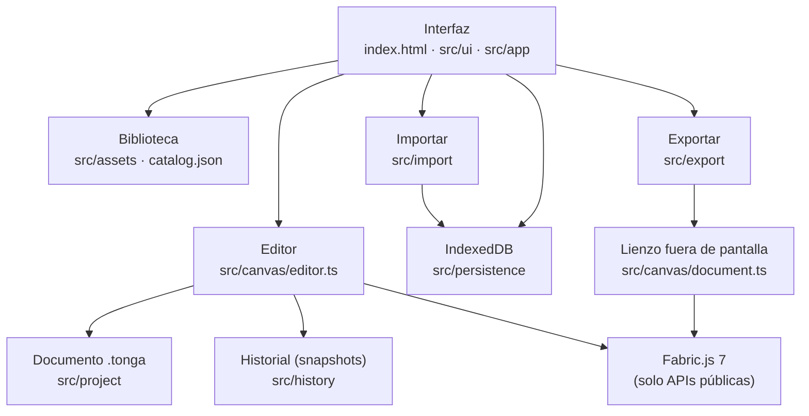

# Arquitectura

Tonga es una aplicación estática de una sola página, sin framework. TypeScript, HTML semántico y CSS; Fabric.js 7 dibuja el lienzo; Vite construye `dist/`.

## Capas

| Capa | Ficheros | Responsabilidad |
|---|---|---|
| Interfaz | `index.html`, `src/ui/*`, `src/app/app.ts`, `src/styles/*` | Barra superior, herramientas, inspector contextual, capas, diálogos nativos (`<dialog>`), avisos (`aria-live`), atajos, temas. `App` conecta la interfaz con el editor y ejecuta en serie las operaciones que cambian el documento. |
| Imagen | `src/canvas/image.ts` | Ajustes (filtros públicos de Fabric) y recorte no destructivo (`cropX`/`cropY`), que se guardan en el `.tonga` y se exportan. |
| Editor | `src/canvas/editor.ts` | Reglas de Tonga sobre Fabric: ids y nombres automáticos («Texto 1»), colocación en el centro, bloqueo y visibilidad, copiar y pegar, alinear, agrupar, orden, zoom, fondo e historial. La interfaz solo habla con esta clase. |
| Documento | `src/project/schema.ts`, `src/project/file.ts`, `src/canvas/document.ts` | El formato `.tonga` con validación y migraciones. Conversión proyecto ⇄ objetos de Fabric, compartida por el editor y por la exportación. |
| Historial | `src/history/history.ts` | Snapshots del documento serializado, con una clave para agrupar interacciones continuas (arrastre, slider), y límites de 100 pasos y 20 MB. Ver [ADR 0007](adr/0007-snapshot-history.md). |
| Biblioteca | `scripts/build-catalog.mjs`, `src/assets/catalog.ts`, `src/ui/library.ts` | `catalog.json` se genera en el build desde los `lista.txt`, con búsqueda sin acentos y miniaturas perezosas. |
| Importar | `src/import/*` | Tipo detectado por los bytes, límites de tamaño, SVG saneado y SVG de Tonga 1 con su fondo. |
| Exportar | `src/export/*` | Render fuera de pantalla a escala 1:1: PNG/JPEG con `toBlob`, SVG autocontenido, PDF con un escritor propio ([ADR 0006](adr/0006-own-pdf-writer.md)) y `.elpx` de eXeLearning: una página con un iDevice «slide» cuya escena es el JSON de Fabric (editable en eXeLearning), más `content.dtd`, `screenshot.png` y el estilo `base` de `vendor/exelearning/`, empaquetados con un escritor ZIP propio (`zip.ts`, entradas sin comprimir). |
| Persistencia | `src/persistence/store.ts`, `src/assets/sources.ts` | IndexedDB para las imágenes (`asset:<sha256>`, guardadas como `ArrayBuffer`) y el autoguardado; `localStorage` solo para el tema. |
| Offline | `src/sw.js`, `vite.config.ts` | Service worker con precache del *shell* por versión y caché bajo demanda de la biblioteca ([ADR 0008](adr/0008-pwa.md)). |

## Decisiones clave

- **Sin framework SPA** ([ADR 0001](adr/0001-no-spa-framework.md)). La UI son unas pocas vistas que se repintan con funciones `render*` a partir del estado del editor.
- **Fabric.js 7 directamente**, sin TOAST UI Image Editor ([ADR 0002](adr/0002-fabric-7.md)). Solo APIs públicas: ESLint rechaza `obj._algo` y limita los imports de `fabric` a `src/canvas`, `src/export` y `src/import`.
- **Origen `center`** para todas las posiciones (valor por defecto de Fabric 7), declarado de forma explícita. La geometría usa `getCenterPoint`, `setPositionByOrigin` y `getBoundingRect`, nunca cálculos a mano sobre `left`/`top`.
- **Formato propio** `.tonga`: el documento de Tonga contiene el `toObject()` de cada objeto, pero el orden, los nombres, la visibilidad y el bloqueo pertenecen a Tonga ([docs/PROJECT-FORMAT.md](PROJECT-FORMAT.md)).
- **Imágenes por contenido.** Una imagen importada se guarda una vez con su SHA-256, y el documento y el historial solo guardan `asset:<hash>`. Así el historial y el autoguardado siguen siendo pequeños aunque haya fotos grandes.
- **Exportación desacoplada del lienzo visible.** El zoom y la selección nunca llegan a los ficheros exportados.

## Flujo de un cambio

1. La persona actúa (botón, teclado, arrastre o inspector).
2. `Editor` modifica los objetos de Fabric y llama a `commit(clave)`.
3. `commit` serializa el documento y lo añade al historial. Las ediciones seguidas con la misma clave cuentan como un paso.
4. `Editor` notifica a sus suscriptores. `App` repinta capas, inspector y botones, y programa el autoguardado.
5. Deshacer restaura el snapshot anterior con `writeProject` y vuelve a seleccionar por id.

## Rutas y despliegue

`base: './'`: todas las URLs son relativas, así que `dist/` funciona en la raíz o en cualquier subdirectorio. `repositorios/` se copia a `dist/repositorios/` y la app lo lee con rutas relativas (`LIBRARY_ROOT = './'`).

## Errores

- Los errores pensados para la persona son `UserError`: el mensaje se muestra tal cual en un aviso y en la consola queda como *warning*.
- Cualquier otro error se registra como `console.error`, y la persona ve un mensaje genérico.
- `unhandledrejection` y `error` tienen un manejador global.
- Los E2E fallan ante cualquier error de consola.
